# Indoor Draft
Indoor旧版本（采用webview制作）

需要至[Bmob官网](http://www.bmob.cn)、[百度地图开放平台](http://lbsyun.baidu.com)、[图灵机器人](http://www.tuling123.com)申请Key

<table>
  <tr>
    <td style="vertical-align:bottom; text-align:center;">
     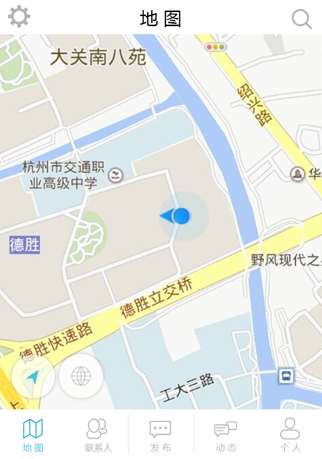
    </td>
    <td style="vertical-align:bottom; text-align:center;">
     
    </td>
    <td style="vertical-align:bottom; text-align:center;">
     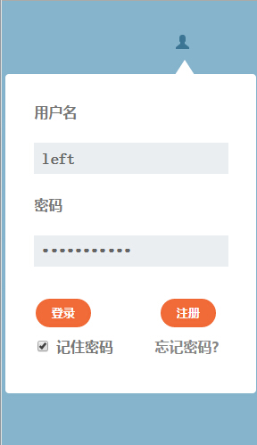
    </td>
    <td style="vertical-align:bottom; text-align:center;">
     
    </td>
  </tr>
  <tr>
    <td style="vertical-align:bottom; text-align:center;">
     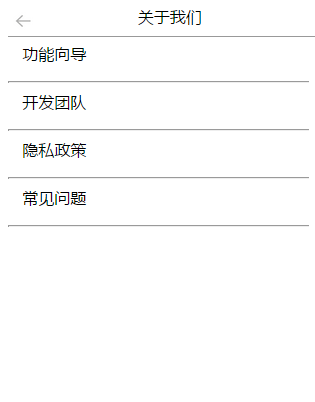
    </td>
    <td style="vertical-align:bottom; text-align:center;">
     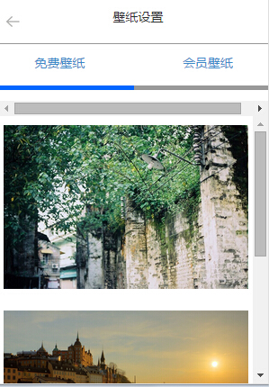
    </td>
    <td style="vertical-align:bottom; text-align:center;">
     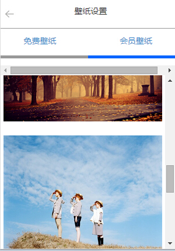
    </td>
    <td style="vertical-align:bottom; text-align:center;">
     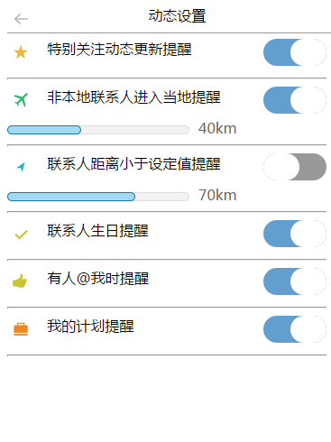
    </td>
  </tr>
  <tr>
    <td style="vertical-align:bottom; text-align:center;">
     
    </td>
    <td style="vertical-align:bottom; text-align:center;">
     
    </td>
    <td style="vertical-align:bottom; text-align:center;">
     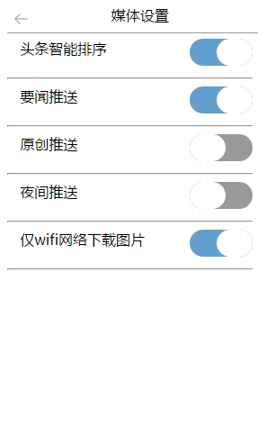
    </td>
    <td style="vertical-align:bottom; text-align:center;">
     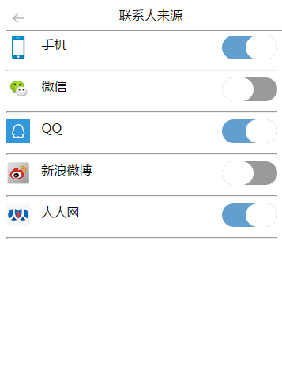
    </td>
  </tr>
  <tr>
    <td style="vertical-align:bottom; text-align:center;">
     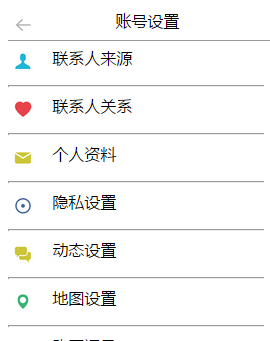
    </td>
    <td style="vertical-align:bottom; text-align:center;">
     
    </td>
    <td style="vertical-align:bottom; text-align:center;">
     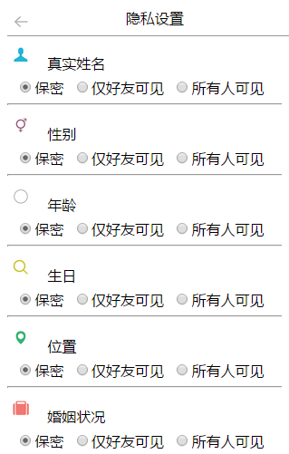
    </td>
    <td style="vertical-align:bottom; text-align:center;">
     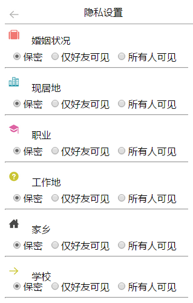
    </td>
  </tr> 
</table>
